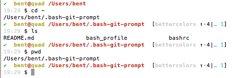

# Informative git prompt for bash using `$NODE_ENV` variable

This prompt is [a fork of the awesome](https://github.com/magicmonty/bash-git-prompt) "Informative git prompt for bash" which has been derived from the original prompt for zsh found [here](https://github.com/olivierverdier/zsh-git-prompt)

### I tweaked the bash build by using an environment variable called `$NODE_ENV` in the informative display.

To use this fork, make sure to `export NODE_ENV=whatever_you_want_to_put_here` first before installing! Make sure to export this `var` in one of your `.profile`, `.bash_profile` or `.bashrc` or otherwise loaded login files.

### Know your machine by its shell window. Display a $NODE_ENV
Since we can add this export line on different machines, the NODE_ENV distinguishes operations and scripting tasks by machine. It's been used for flagging development vs. production settings in node.js. However, I find it's more helpful in distributed scenerios where messages between machines can be flagged and identified by different origin environments.

### Display an Informative Git Repo
Primarily this is ``bash`` prompt that displays information about the current git repository. In particular the branch name, difference with remote branch, number of files staged, changed, etc.

## Examples

This forked prompt looks like the following:



* ``(master↑3|✚1)``: on branch ``master``, ahead of remote by 3 commits, 1 file changed but not staged
* ``(status|●2)``: on branch ``status``, 2 files staged
* ``(master|✚7…)``: on branch ``master``, 7 files changed, some files untracked
* ``(master|✖2✚3)``: on branch ``master``, 2 conflicts, 3 files changed
* ``(experimental↓2↑3|✔)``: on branch ``experimental``; your branch has diverged by 3 commits, remote by 2 commits; the repository is otherwise clean
* ``(:70c2952|✔)``: not on any branch; parent commit has hash ``70c2952``; the repository is otherwise clean

##  Prompt Structure

By default, the general appearance of the prompt is::

    (<branch> <branch tracking>|<local status>)

The symbols are as follows:

- Local Status Symbols
  - ``✔``: repository clean
  - ``●n``: there are ``n`` staged files
  - ``✖n``: there are ``n`` unmerged files
  - ``✚n``: there are ``n`` changed but *unstaged* files
  - ``…n``: there are ``n`` untracked files
- Branch Tracking Symbols
  - ``↑n``: ahead of remote by ``n`` commits
  - ``↓n``: behind remote by ``n`` commits
  - ``↓m↑n``: branches diverged, other by ``m`` commits, yours by ``n`` commits
- Branch Symbol:<br />
  	When the branch name starts with a colon ``:``, it means it's actually a hash, not a branch (although it should be pretty clear, unless you name your branches like hashes :-)

## Install

1. Clone this repo to your homedir and source its entry point into your login session.
```bash
$ git clone https://github.com/reqshark/bash-git-prompt.git ~/.bash-git-prompt
$ source ~/.bash-git-prompt/gitprompt.sh
```
2. If you like, append that source command to your `.bashrc` or `.bash_profile` so `gitprompt.sh` script runs at login.
```bash
$ echo -e "source $HOME/.bash-git-prompt/gitprompt.sh" >> "$HOME/.bashrc"
```
3. Go in a git repository and check it out!

## Configuration

1. You can use ``GIT_PROMPT_START`` and ``GIT_PROMPT_END`` to tweak your prompt
2. If you want to tweak the colors, change all the good stuff from inside `themes` dir.
3. You can make calls from the ``prompt_callback`` function in `gitprompt.sh` to manage other dynamic prompt behavior.

```sh
function prompt_callback {
    if [ `jobs | wc -l` -ne 0 ]; then
        echo -n " jobs:\j"
    fi
}
```

[original blog post]: http://sebastiancelis.com/2009/nov/16/zsh-prompt-git-users/
